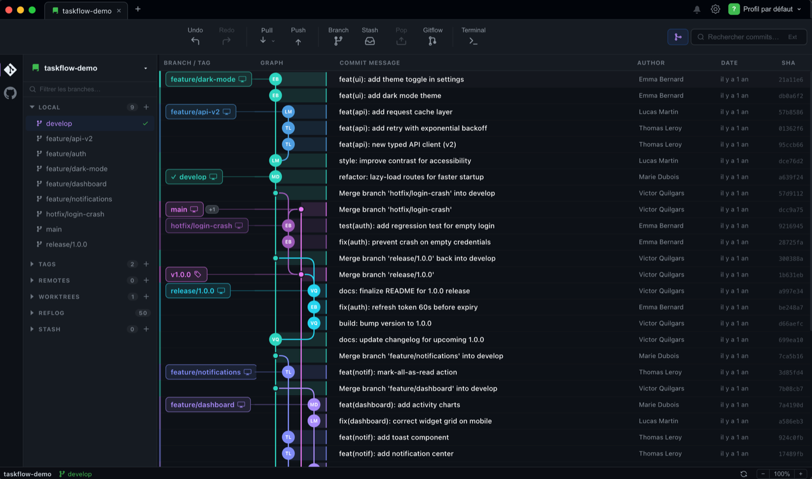
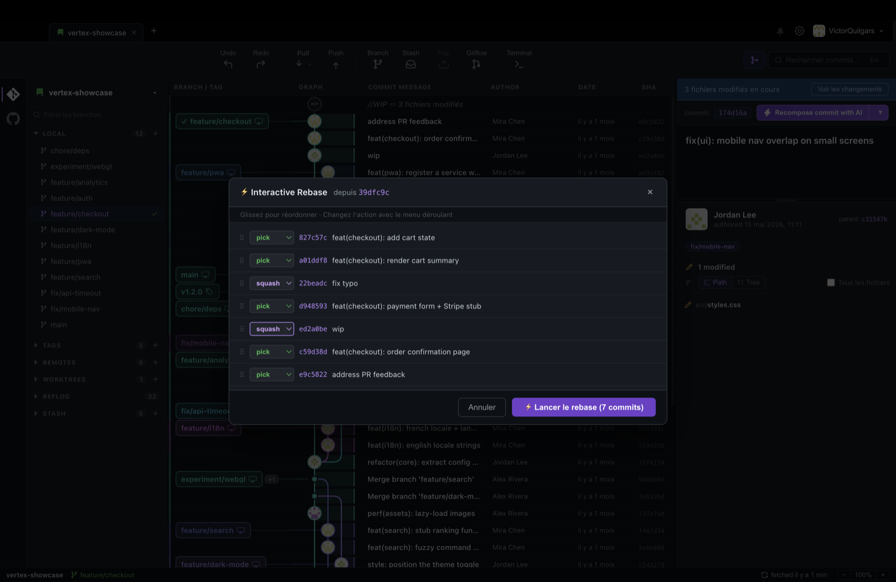
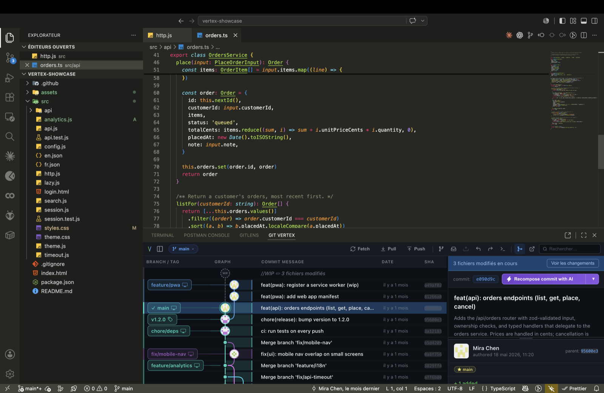
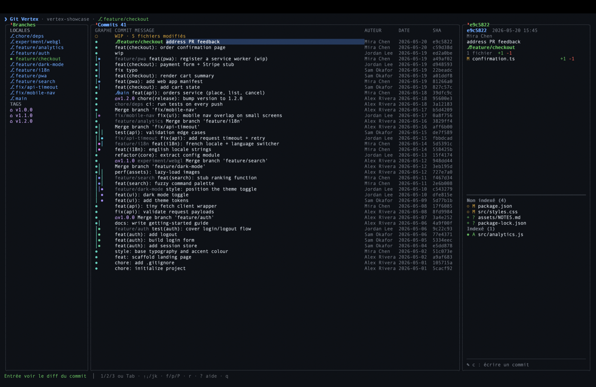

<p align="center">
  
</p>

<h1 align="center">Git Vertex</h1>

<p align="center">
  A fast, modern Git GUI for developers.<br/>
  Visualize branches, stage changes, and manage commits with a clean interface.
</p>

<p align="center">
  <a href="https://marketplace.visualstudio.com/items?itemName=VictorQuilgars.git-vertex"></a>
  
  
  
</p>

<p align="center">
  
</p>

---

## One tool, four surfaces

| | |
|---|---|
| **Desktop app** | Full-featured Git client for macOS (Electron + React) — this repo's root |
| **[VS Code extension](https://marketplace.visualstudio.com/items?itemName=VictorQuilgars.git-vertex)** | The same commit graph, staging and interactive rebase inside VS Code — [`vscode-extension/`](vscode-extension/) |
| **Terminal UI** | Keyboard-driven Git client for the terminal — [`cli/`](cli/) |
| **MCP server** | Gives coding agents structured Git context and safe, review-first write proposals — [`mcp/`](mcp/) |

## Features

- **Commit graph** — visualize branches and merges in a modern, curved graph
- **Stage & commit** — stage individual files or hunks, amend commits
- **Interactive rebase** — reorder, squash, drop commits visually
- **Push & pull** — push to any remote and branch with custom options
- **AI commit messages** — generate commit messages with Anthropic, Google, Groq or OpenAI
- **Branch management** — create, checkout, cherry-pick, revert, reset
- **Tags** — create and visualize tags directly in the graph

## Screenshots

**Interactive rebase** — reorder, squash and reword visually:



**VS Code extension** — the full commit graph and staging panel inside your editor:



**Terminal UI** — the whole workflow from the keyboard:



## Stack

- [Electron](https://www.electronjs.org/) + [React](https://react.dev/) + [TypeScript](https://www.typescriptlang.org/)
- [electron-vite](https://electron-vite.org/) for the build system
- [simple-git](https://github.com/steveukx/git-js) for git operations

## Getting started

```bash
git clone https://github.com/VictorQuilgars/git-vertex.git
cd git-vertex
npm install
npm run dev
```

## Build

```bash
npm run package             # installer for the current platform
npm run package -- --mac    # or --win / --linux
```

Installers land in `dist/` (`.dmg` on macOS, NSIS `.exe` on Windows, AppImage/deb on Linux).

## Contributing

Bug reports and feature requests are welcome — see [CONTRIBUTING.md](CONTRIBUTING.md).

## License

[FSL-1.1-MIT](LICENSE.md) (Functional Source License). You may use, copy, modify
and redistribute Git Vertex for any purpose other than a competing commercial
product or service. Each version becomes available under the MIT license two
years after its release.

Versions published before July 2026 (extension ≤ 1.15.0, MCP server ≤ 0.4.0,
CLI ≤ 0.1.0) remain under their original MIT license.
